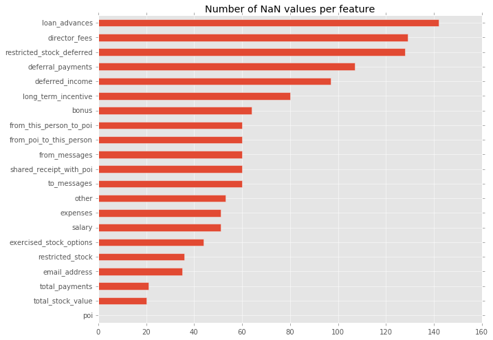
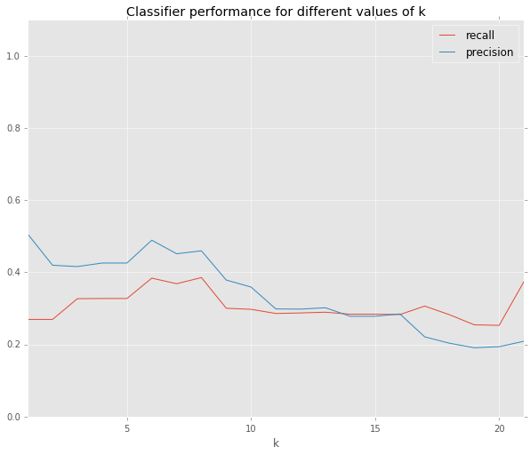

# Report

## Project goals
>Summarize for us the goal of this project and how machine learning is useful in trying to accomplish it.

The goal of this project is to identify people that participated in the Enron fraud. The starting point for this investigation is a dataset on Enron employees that describes both employee financials and email behavior. Part of the dataset was manually labelled to distinguish between persons of interest (POI) and people that were not of interest. Persons of interest are those people for which it is known that they took part in the fraud.

We use the labelled data to train a machine learning algorithm that will help us to identify persons of interest.

> Give some background on the dataset and how it can be used to answer the project question.

The dataset used for training the classifier contains information on 146 Enron employees across 21 features. In total, 18 of these employees were labelled as a person of interest. The features in the dataset, such as the total bonus paid to an employee, may be an indication of an employee being involved in fraud. The 21 features can roughly be divided in the following categories:

Related to financials (in USD):
- **bonus**: financial bonus
- **salary**: yearly salary
- **total_stock_value**: total value of the stocks owned
- **restricted_stock**: some form of stock value
- **restricted_stock_deferred**: some form of stock value
- **total_payments**: sum of all payments
- **expenses**: the expenses done by Enron for this person
- **director_fees**: the fees received by this person because he/she is a director
- **exercised_stock_options**: stock options that were traded for money before Enron's bankruptcy
- **long_term_incentive**: bonus that is paid for achieving long term results
- **deferred_income**: salary that is not paid right away, but put aside for withdrawal at some later time
- **deferral_payments**: amount of money withdrawn from deferred income
- **loan_advances**: loan provided by Enron to an employee
- **other**: other payments

Related to emails:
- **email_address**: the person's email address
- **from_messages**: the amount of email messages sent by this person
- **to_messages**: the amount of email messages received by this person
- **from_poi_to_this_person**: the amount of email messages from a person of interest to this person
- **from_this_person_to_poi**: the amount of email messages from this person to a person of interest
- shared_receipt_with_poi

Related to persons of interest:
- **poi**: flag to identify whether a person is a person of interest. E.g. because of lawsuits etc.

> Were there any outliers in the data when you got it, and how did you handle those?

For the full exploration of outliers, please refer to the notebook included with this submission, `data exploration.ipynb`. Here I will summarize my findings:

The first outlier that immediately caught my eye, was the entry *TOTAL*. I found this outlier by plotting a histogram of employee salaries, which showed a value of 26.7 million USD all the way to the right. Assuming that this entry describes the total for all numeric columns, I removed the entry from the dataset.

Apart from this obvious outlier, there was one other employee that I excluded: *The Travel Agency In The Park*. The name of this entry suggested that it did not describe an employee but rather a company of some sort.

The table below shows the missing values per feature. It can be seen that the POI feature is filled for each person, whereas loan_advances the feature with the most missing values (142 to be exact).

## Feature selection
> What features did you end up using in your POI identifier, and what selection process did you use to pick them?

I used scikit-learn's `SelectKBest` module to select what features to use in training a classifier. As a scoring function I used `f-classif`. To test what number of features to include, I set up a Gaussian Naive Bayes classifier in combination with an adapted version of the scoring function in `tester.py`. The result can be found in the figure below, which shows the classifier performance in terms of recall and precision for different values of k.  

From this figure it becomes apparent that the best number of features to include is 6. The table below summarizes these findings:

| metric    | value |
|-----------|-------|
| f1        | 0.43  |
| f2        | 0.40  |
| recall    | 0.38  |
| precision | 0.49  |
| accuracy  | 0.86  |

Features and their relative importance

| feature                  | score |
|--------------------------|-------|
| bonus                    |  20.79  |
| deferred_income          |  .     |
| exercised_stock_options  |  .     |
| relative_messages_to_poi |  .     |
| salary                   |  .     |
| total_stock_value        |  .     |

The fourth feature in this table (`relative_messages_to_poi `) is a feature I engineered myself. My idea was that it does not make sense to look at just he number of messages sent to a person of interest. Rather, I want to include what proportion of emails sent by someone is sent to a person of interest.

## Algorithm selection
> What algorithm did you end up using? What other one(s) did you try? How did model performance differ between algorithms?

In the final version I used a Naive Bayes classifier. The reason is that this classifier led to a satisfactory precision and recall out-of-the box with the features presented above.

I did try some other classifiers and feature combinations, see the results below.

#### Result using top-5 features from SelectKBest and a Naive Bayes classifier

    GaussianNB()
        Accuracy: 0.73900
        Precision: 0.22604
        Recall: 0.39500
        F1: 0.28753
        F2: 0.34363
        Total predictions: 15000        
        True positives:  790    
        False positives: 2705   
        False negatives: 1210   
        True negatives: 10295

#### Result using intuitively selected features and a Naive Bayes classifier

    GaussianNB()
        Accuracy: 0.81940
        Precision: 0.35654
        Recall: 0.44050
        F1: 0.39410
        F2: 0.42069
        Total predictions: 15000
        True positives:  881
        False positives: 1590
        False negatives: 1119
        True negatives: 11410

#### Result using intuitively selected features and GridSearchCV with a SVM classifier
Grid search definition:

    GridSearchCV(cv=None, error_score='raise',
       estimator=SVC(C=1.0, cache_size=200, class_weight=None, coef0=0.0,
           decision_function_shape=None, degree=3, gamma='auto', kernel='rbf',
           max_iter=-1, probability=False, random_state=None, shrinking=True,
           tol=0.001, verbose=False),
       fit_params={}, iid=True, n_jobs=1,
       param_grid={'C': [0.01, 0.1, 1, 10, 100], 'gamma': [0.01, 0.1, 10, 100]},
       pre_dispatch='2*n_jobs', refit=True, scoring=None, verbose=0)

Result:

       Got a divide by zero when trying out: [..]
       Precision or recall may be undefined due to a lack of true positive predictions.

#### Result using intuitively selected features and GridSearchCV with a DecisionTreeClassifier

Grid search definition:

    GridSearchCV(cv=None, error_score='raise',
       estimator=DecisionTreeClassifier(class_weight=None, criterion='gini', max_depth=None,
            max_features=None, max_leaf_nodes=None, min_samples_leaf=1,
            min_samples_split=2, min_weight_fraction_leaf=0.0,
            presort=False, random_state=None, splitter='best'),
       fit_params={}, iid=True, n_jobs=1,
       param_grid={'min_samples_split': [2, 4, 6, 8, 10, 12, 14, 16, 18, 20]},
       pre_dispatch='2*n_jobs', refit=True, scoring=None, verbose=0)

Results:

        Accuracy: 0.81733       
        Precision: 0.27791      
        Recall: 0.23150
        F1: 0.25259     
        F2: 0.23950
        Total predictions: 15000        
        True positives:  463    
        False positives: 1203   
        False negatives: 1537   
        True negatives: 11797

## Parameter tuning
>What does it mean to tune the parameters of an algorithm, and what can happen if you don’t do this well?  How did you tune the parameters of your particular algorithm?

Tuning the parameters of an algorithm means that you look for the set of parameters that results in the best algorithm performance on the testing set. An algorithm that is not tuned well, may overfit to the training data or not perform as well as it would when the algorithm *is* tuned.

I did not tune the Naive Bayes classifier, but I did use GridSearchCV for the DecisionTreeClassifier and the SVM classifier. For the DecisionTreeClassifier I tuned the parameter min_samples_split, which specifies how many samples should at least be in a branch for the algorithm to be 'allowed' to split the branch. For the SVM classifier I tuned the C and gamma parameters as suggested by the [sklearn documentation](http://scikit-learn.org/stable/auto_examples/svm/plot_rbf_parameters.html). C is the penalty for the error term and gamma the kernel coefficient for the rbf kernel. As the documentation puts it, C specifies the penalty for misclassifying an observation whereas gamma specifies the influence of a single observation on the overall model.

## Validation
>What is validation, and what’s a classic mistake you can make if you do it wrong? How did you validate your analysis?

Validation means that we assert the performance of a trained classifier on data that it has not seen before. As such we test how well a classifier generalizes to unseen data. A classic mistake is to train and test a classifier on the same (training) data.

For the validation of my classifier I used the provided tester file `tester.py`. This file uses a stratified shuffle split cross-validation strategy to validate the performance of a classifier.

## Evaluation metrics
>Give at least 2 evaluation metrics and your average performance for each of them.  Explain an interpretation of your metrics that says something human-understandable about your algorithm’s performance.

As presented in the section *Algorithm Selection*, the precision of my classifier is 0.357 and the recall equals 0.441. Intuitively, this means that 35.7% of the employees that were classified as person of interest, were indeed a person of interest. Moreover, of all persons of interest in the dataset, the classifier is able to identify 44.1% correctly as a person of interest.
